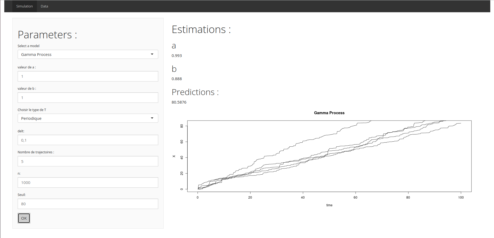
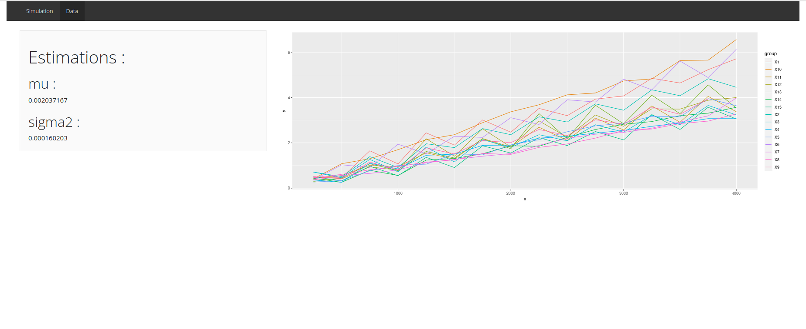

\vspace{15mm}
\begin{center}
\includegraphics{couverture.png}
\end{center}

\vspace{5mm}

\text{Corentin Alary-Ferrandiz | Aya Elarbaoui | Soufiane Lemrabet | Dillane Mahan | Abdoul Kader}

\vspace{50mm}
\begin{flushright}
\includegraphics[width=0.4\columnwidth]{logoEnsimag.jpeg}
\end{flushright}

\newpage

\textcolor{red}{\tableofcontents}

\newpage

\section{\textcolor{red}{I.Introduction}}

L’objet de ce projet était d’étudier différents processus de dégradation. Avant de présenter notre travail, nous allons donc expliquer brièvement ce qu’est un «processus de dégradation» ainsi qu’expliciter l’intérêt de leur étude. 
  
Le terme «Processus de dégradation» fait référence à un ensemble de modèles probabilistes qui correspondent à différents types de processus stochastiques. De nombreux phénomènes de dégradations comme par exemple les processus d’usure de composants matériels, la corrosion ou encore la croissance de fissures peuvent se modéliser par des processus de dégradation. Les étudier permet de mieux les comprendre et de prédire leur évolution. Dans le cadre industriel cela permet notamment de prévoir la date à laquelle un composant atteindra son niveau d’usure critique afin de faire de la maintenance prédictive. Dans la suite, c’est dans cette perspective que nous avons étudié le processus de gamma et le processus de Wiener en les simulant ainsi qu'en estimant les paramètres les caractérisants à la fois sur des données simulées et réelles. 
  
Le support qui a été choisi lors de ce projet afin de visualiser nos résultats est une application web Shiny.
  
\section{\textcolor{red}{II.Organisation Générale}}

Afin de bien identifier la source de nos eventuelles erreurs et de permettre de faire évoluer facilement notre application Shiny nous avons décidé de cloisonner au maximum notre travail. 
Nous avons ainsi travaillé en séparant trois grandes parties. 

La première partie était celle de l'application web en elle-même composé des fichiers server.R, consacré aux calculs côtés serveur de l'application,  et ui.R, consacré à l'interface graphique de l'application.  

La seconde partie concernait la simulation des processus de dégradation et l'estimation des paramètres les caractérisant sur des données simulées puis réelles. En dehors de server.R et ui.R, tous les fichiers .R de notre projet se situent dans cette partie. Dans celle-ci se trouve également des fichiers.csv contenant des données réelles de dégradation.

La troisième partie quant à elle était la partie purement mathématique avec tous les calculs permettant d'estimer les paramètres des différents processus de dégradation.
  

\section{\textcolor{red}{III.Etude du processus de Wiener}}

Le premier processus que nous avons étudié est le processus de Wiener qui modélise une dégradation continue avec une tendance croissante mais avec une trajectoire non monotone.

Voici sa définition :
Le processus stochastique $W = (W_t)_{t \ge 0}$ est un processus de Wiener si 
$\forall t \ge 0$, $W_t = \mu t + \sigma B_t$
où $\mu \in \mathbb{R}$, $\sigma > 0$ et $(B_t)_{t \ge 0}$ est un mouvement brownien.
Dans ce cas $\mu$ est un paramètre de "drift" et $\sigma^2$ un paramètre de variance (ou de volatilité).

\subsection{\textcolor{red}{III.1 : Calcul des estimateurs du maximum de vraisemblance}}

Nous nous plaçons dans le cas où nous observons d trajectoires de dégrations que nous modélisons par des processus de Wiener. Pour chacun de ces phénomènes nous relevons n instants de la dégradation.

Notons $W_{t_i}^{(k)}$ la variable pour modélisant le niveau de dégradation à l'instant $ti$ du phénomène k.

Soit $\Delta W_{i}^{(k)} = W_{t_i}^{(k)} - W_{t_{i-1}}^{(k)}$ alors $\Delta W_{i}^{(k)} \sim \mathcal{N}(\mu\Delta t_i, \sigma^2 \Delta t_i )$ avec $\Delta t_i = t_i - t_{i-1}$

Calculons ainsi le fonction de vraisemblance pour les d échantillons $\Delta w_1, ..., \Delta w_n$

$$
\begin{aligned}
\mathcal{L}(\Delta w_1^{(1)}, ..., \Delta w_n^{(1)}, ..., \Delta w_1^{(d)},..., \Delta w_n^{(d)}, \mu, \sigma) &= f_{\Delta W_1^{(1)}, ..., \Delta W_n^{(1)} , ..., \Delta W_1^{(d)},..., \Delta W_n^{(d)}} (\Delta w_1^{(1)}, ..., \Delta w_n^{(1)}, ..., \Delta w_1^{(d)},..., \Delta w_n^{(d)}, \mu, \sigma) \\
                &= \prod_{k = 1}^{d} f_{\Delta W_1^{(k)}, ..., \Delta W_n^{(k)}} (\Delta w_1^{(k)}, ..., \Delta w_n^{(k)}, \mu, \sigma)\\
                &= \prod_{k = 1}^{d} \prod_{i = 1}^{n} f_{\Delta W_i^{(k)}}(\Delta w_i^{(k)}, \mu, \sigma)\\
                &= \prod_{k = 1}^{d} \prod_{i = 1}^{n} \frac{1}{\sigma \sqrt{\Delta t_i} \sqrt{2\pi} } e^{-\frac{1}{2}(\frac{(\Delta w_i^{(k)} -\mu \Delta t_i)^2 }{\sigma^2 \Delta t_i}) }\\
                &=(\frac{1}{\sigma \sqrt{2\pi}})^{nd} (\prod_{i = 1}^{n} \frac{1}{\sqrt{\Delta t_i}})^d  \prod_{k = 1}^{d} e^{- \frac{1}{2} \sum_{i=1}^{n} (\frac{(\Delta w_i^{(k)} -\mu \Delta t_i)^2 }{\sigma^2 \Delta t_i}) }\\
                &= (\frac{1}{\sigma \sqrt{2\pi}})^{nd} (\prod_{i = 1}^{n} \frac{1}{\sqrt{\Delta t_i}})^d e^{-\frac{1}{2} \sum_{k=1}^{d} \sum_{i=1}^{n} (\frac{(\Delta w_i^{(k)} -\mu \Delta t_i)^2 }{\sigma^2 \Delta t_i})}
\end{aligned}                
$$
D'où :
$$
ln(\mathcal{L}(\Delta w_1^{(1)}, ..., \Delta w_n^{(1)}, ..., \Delta w_1^{(d)},..., \Delta w_n^{(d)}, \mu, \sigma)) = nd \times ln(\frac{1}{\sigma \sqrt{2\pi}}) - d \times ln(\prod_{i = 1}^{n} \frac{1}{\sqrt{\Delta t_i}}) -\frac{1}{2} \sum_{k=1}^{d} \sum_{i=1}^{n} (\frac{(\Delta w_i^{(k)} -\mu \Delta t_i)^2 }{\sigma^2 \Delta t_i})
$$

\subsubsection{\textcolor{red}{Estimateur de maximum de vraisemblance de $\mu$, $\hat{\mu}$}}

Notons le résultat suivant :
$$
\dfrac{\partial (\mu \rightarrow \frac{(\Delta w_i^{(k)} -\mu \Delta t_i)^2 }{\sigma^2 \Delta t_i})  }{\partial \mu}= \frac{-2(\Delta w_i^{(k)} -\mu \Delta t_i)}{\sigma^2}
$$

Ainsi :
$$
\begin{aligned}
\dfrac{\partial ln(\mathcal{L}(\Delta w_1^{(1)}, ..., \Delta w_n^{(1)}, ..., \Delta w_1^{(d)},..., \Delta w_n^{(d)}, \mu, \sigma)) }{\partial \mu} &= -\frac{1}{2} \sum_{k=1}^{d} \sum_{i=1}^{n} \frac{-2(\Delta w_i^{(k)} -\mu \Delta t_i)}{\sigma^2}\\
&= \sum_{k=1}^{d} [\frac{1}{\sigma^2} \sum_{i=1}^{n} \Delta w_i^{(k)} - \frac{\mu}{\sigma^2} \sum_{i=1}^{n}\Delta t_i ]\\
&= \frac{1}{\sigma^2} \sum_{k=1}^{d} \sum_{i=1}^{n} \Delta w_i^{(k)} - \frac{\mu}{\sigma^2} \sum_{k=1}^{d} \sum_{i=1}^{n} \Delta t_i \\
\dfrac{\partial ln(\mathcal{L}(\Delta w_1^{(1)}, ..., \Delta w_n^{(1)}, ..., \Delta w_1^{(d)},..., \Delta w_n^{(d)}, \mu, \sigma)) }{\partial \mu} &= \frac{1}{\sigma^2} \sum_{k=1}^{d} \sum_{i=1}^{n} \Delta w_i^{(k)} - \frac{\mu \times d}{\sigma^2} \sum_{i=1}^{n} \Delta t_i
\end{aligned}
$$

Ainsi on obtient que :
$$
\dfrac{\partial ln(\mathcal{L}(\Delta w_1^{(1)}, ..., \Delta w_n^{(1)}, ..., \Delta w_1^{(d)},..., \Delta w_n^{(d)}, \mu, \sigma)) }{\partial \mu}= 0 \\
$$
$\Leftrightarrow$
$$
\frac{\mu \times d}{\sigma^2} \sum_{i=1}^{n} \Delta t_i = \frac{1}{\sigma^2} \sum_{k=1}^{d} \sum_{i=1}^{n} \Delta w_i^{(k)}
$$
$\Leftrightarrow$
$$
\mu = \frac{1}{d\sum_{i=1}^{n} \Delta t_i} \times \sum_{k=1}^{d} \sum_{i=1}^{n} \Delta w_i^{(k)}
$$

Ainsi :
\fbox{$\hat{\mu} = \frac{1}{d\sum_{i=1}^{n} \Delta t_i} \times \sum_{k=1}^{d} \sum_{i=1}^{n} \Delta W_i^{(k)} = \frac{\sum_{k=1}^{d} W_n^{(k)}}{d\times t_n}$}

\subsubsection{\textcolor{red}{ Estimateur du maximum de vraisemblance de $\sigma^2$, $\hat{\sigma^2}$}}

$$
ln(\mathcal{L}(\Delta w_1^{(1)}, ..., \Delta w_n^{(1)}, ..., \Delta w_1^{(d)},..., \Delta w_n^{(d)}, \mu, \sigma)) = nd \times ln(\frac{1}{\sigma \sqrt{2\pi}}) - d \times ln(\prod_{i = 1}^{n} \frac{1}{\sqrt{\Delta t_i}}) -\frac{1}{2} \sum_{k=1}^{d} \sum_{i=1}^{n} (\frac{(\Delta w_i^{(k)} -\mu \Delta t_i)^2 }{\sigma^2 \Delta t_i})
$$ 
Notons le résultat suivant :

$$
\dfrac{\partial (\sigma \rightarrow \frac{(\Delta w_i^{(k)} -\mu \Delta t_i)^2 }{\sigma^2 \Delta t_i})  }{\partial \sigma^2}= -\frac{(\Delta w_i^{(k)} -\mu \Delta t_i)^2 }{(\sigma^2)^2 \Delta t_i}  
$$
Notons également le second résultat suivant:
$$
\dfrac{\partial (\sigma \rightarrow nd \times ln(\frac{1}{\sigma \sqrt{2\pi}}) )  }{\partial \sigma^2}= \frac{-nd}{2\sigma^2}
$$

Ainsi on obtient :
$$
\begin{aligned}
\dfrac{\partial ln(\mathcal{L}(\Delta w_1^{(1)}, ..., \Delta w_n^{(1)}, ..., \Delta w_1^{(d)},..., \Delta w_n^{(d)}, \mu, \sigma)) }{\partial \sigma^2} &= \frac{-nd}{2\sigma^2} -\frac{1}{2}\sum_{k=1}^{d} \sum_{i=1}^{n} -\frac{(\Delta w_i^{(k)} -\mu \Delta t_i)^2 }{(\sigma^2)^2 \Delta t_i} \\
&=\frac{1}{(\sigma^2)^2}(-nd \times \sigma^2  + \sum_{k=1}^{d} \sum_{i=1}^{n} \frac{(\Delta w_i^{(k)} -\mu \Delta t_i)^2}{ \Delta t_i})
\end{aligned}
$$
Par conséquent :
$$
\dfrac{\partial ln(\mathcal{L}(\Delta w_1^{(1)}, ..., \Delta w_n^{(1)}, ..., \Delta w_1^{(d)},..., \Delta w_n^{(d)}, \mu, \sigma)) }{\partial \sigma^2} = 0
$$
$\Leftrightarrow$
$$
nd \times \sigma^2 = \sum_{k=1}^{d} \sum_{i=1}^{n} \frac{(\Delta w_i^{(k)} -\mu \Delta t_i)^2}{ \Delta t_i}
$$

Ainsi :

\fbox{$\hat{\sigma^2} = \frac{1}{nd} \times \sum_{k=1}^{d} \sum_{i=1}^{n} \frac{(\Delta W_i^{(k)} -\hat\mu \Delta t_i)^2}{ \Delta t_i} = \frac{1}{nd} \sum_{k=1}^{d} \sum_{i=1}^{n} \frac{(\Delta W_i^{(k)})^2}{\Delta t_i} - \hat{\mu}^2 \frac{t_n}{n}$}

\subsection{\textcolor{red}{ III.2 : Biais des estimateurs du maximum de vraisemblance}}

\subsubsection{\textcolor{red}{ Biais de $\hat{\mu}$}}

$\hat{\mu} = \frac{\sum_{k=1}^{d} W_n^{(k)}}{d\times t_n}$

Or $W_n^{(k)} \sim \mathcal{N}(\mu t_n, \sigma^2 t_n)$

Donc:
$$
\begin{aligned}
\mathbb{E}[\hat{\mu}] &= \mathbb{E} [\frac{\sum_{k=1}^{d} W_n^{(k)}}{d\times t_n}] \\
                      &= \frac{\sum_{k=1}^{d} \mathbb{E}[W_n^{(k)}]}{d\times t_n}  \\
                      &= \frac{d\times \mu t_n }{d \times t_n}\\
\mathbb{E}[\hat{\mu}] &= \mu
\end{aligned}
$$
Par conséquent $\hat{\mu}$ est sans biais

\subsubsection{\textcolor{red}{ Biais de $\hat{\sigma^2}$}}

$\bullet$On sait que $\Delta W_i^{(k)} \sim \mathcal{N}(\mu \Delta t_i, \sigma^2 \Delta t_i )$ 

Donc:
$$
\begin{aligned}
\mathbb{E}[(\Delta W_i^{(k)})^2] &= Var[\Delta W_i^{(k)}] + \mathbb{E}[\Delta W_i^{(k)}]^2 \\
&= \sigma^2\Delta t_i + \mu^2 \Delta t_i \\
\mathbb{E}[(\Delta W_i^{(k)})^2] &=\Delta t_i(\sigma^2 + \mu^2 \Delta t_i)
\end{aligned}
$$

$\bullet$On sait que $W_n^{(k)} \sim \mathcal{N}(\mu t_n, \sigma^2 t_n)$ :

Donc $\sum_{k=1}^{d} W_n^{(k)} \sim \mathcal{N}(\mu d\times t_n, \sigma^2 d\times t_n )$

$\hat{\mu} = \frac{\sum_{k=1}^{d} W_n^{(k)}}{d\times t_n} \sim \mathcal{N}(\mu, \frac{\sigma^2}{d\times t_n})$

Par conséquent :
$$
\begin{aligned}
\mathbb{E}[\hat{\mu}^2 \times \frac{t_n}{n}] &= \frac{t_n}{n} \mathbb{E}[\hat{\mu}^2]\\
&= \frac{t_n}{n} [Var[\hat{\mu}] + \mathbb{E}[\hat{\mu}]^2] \\
&= \frac{t_n}{n}[\frac{\sigma^2}{d\times t_n} + \mu^2] \\
\mathbb{E}[\hat{\mu}^2 \times \frac{t_n}{n}] &= \frac{\sigma^2}{nd} + \mu^2\frac{t_n}{n}
\end{aligned}
$$

$\bullet$ Finalement à partir de ces résultats intermediaires on calcule le biais de $\hat{\sigma}^2$

$$
\begin{aligned}
\mathbb{E}[\hat{\sigma^2}] &= \mathbb{E}[\frac{1}{nd} \sum_{k=1}^{d} \sum_{i=1}^{n} \frac{(\Delta W_i^{(k)})^2}{\Delta t_i} - \hat{\mu}^2 \frac{t_n}{n}] \\
&= \frac{1}{nd} \sum_{k=1}^{d} \sum_{i=1}^{n} \frac{\mathbb{E}[(\Delta W_i^{(k)})^2]}{\Delta t_i} - \mathbb{E}[\hat{\mu}^2 \frac{t_n}{n}]  \\
&= \frac{1}{nd} \sum_{k=1}^{d} \sum_{i=1}^{n} (\sigma^2 + \mu^2 \Delta t_i) - (\frac{\sigma^2}{nd} + \mu^2\frac{t_n}{n}) \\
&= \sigma^2 + \frac{\mu^2 t_n}{n} - \frac{\sigma^2}{nd} - \mu^2\frac{t_n}{n} \\
\mathbb{E}[\hat{\sigma^2}] &= \sigma^2 (\frac{nd - 1}{nd})
\end{aligned}
$$
Par conséquent $\hat{\sigma^2}$ est biaisé mais il est simple de le débiaisé pour obtenir $\hat{\sigma^2}'$: 

$\hat{\sigma^2}' = \frac{nd}{nd -1} \hat{\sigma^2}$ Ainsi :

\fbox{$\hat{\sigma^2}' =\frac{1}{nd - 1} \times \sum_{k=1}^{d} \sum_{i=1}^{n} \frac{(\Delta W_i^{(k)} -\hat\mu \Delta t_i)^2}{ \Delta t_i}$}

\subsection{\textcolor{red}{ III.3 : Calcul des estimateurs des moments}}

\subsubsection{\textcolor{red}{ Estimateur des moments de $\mu$, $\tilde{\mu}$}}

On sait que $W_n^{(k)} \sim \mathcal{N}(\mu t_n, \sigma^2 t_n)$ et donc $\frac{ W_n^{(k)}}{t_n} \sim \mathcal{N}(\mu, \frac{\sigma^2}{ t_n})$

 Ainsi $\mathbb{E}[\frac{W_n^{(k)}}{t_n}] = \mu$
 
 Donc  $\tilde{\mu} = \frac{1}{d} \sum_{k = 1}^{d} \frac{W_n^{(k)}}{ t_n}$

Finalement : 

\fbox{$\tilde{\mu} = \frac{1}{d t_n} \sum_{k=1}^{d} W_n^{(k)} = \hat{\mu}$}

\subsubsection{\textcolor{red}{ Estimateur des moments de $\sigma^2$, $\tilde{\sigma^2}$}}

On sait que $\Delta W_i^{(k)} \sim \mathcal{N}(\mu \Delta t_i, \sigma^2 \Delta t_i)$

Donc $\frac{\Delta W_i^{(k)} - \mu \Delta t_i}{\sqrt{\Delta t_i}} \sim \mathcal{N}(0, \sigma^2)$

Finalement :
\fbox{$\tilde{\sigma^2} = \frac{1}{nd}\sum_{k = 1}^{d} \sum_{i = 1}^{n} \frac{(\Delta W_i^{(k)} - \tilde{\mu} \Delta t_i)^2}{\Delta t_i}$}

\subsection{\textcolor{red}{ III.4.Biais des estimateurs des moments}}

\subsubsection{\textcolor{red}{ Biais de $\tilde{\mu}$}}

Comme $\tilde{\mu} = \hat{\mu}$ et que $\hat{\mu}$ est sans biais, alors $\tilde{\mu}$ est sans biais.

\subsubsection{\textcolor{red}{ Biais de $\tilde{\sigma^2}$}}

Comme $\tilde{\mu} = \hat{\mu}$, $\tilde{\sigma^2} = \frac{1}{nd}\sum_{k = 1}^{d} \sum_{i = 1}^{n} \frac{(\Delta W_i^{(k)} - \tilde{\mu} \Delta t_i)^2}{\Delta t_i} = \frac{1}{nd}\sum_{k = 1}^{d} \sum_{i = 1}^{n} \frac{(\Delta W_i^{(k)} - \hat{\mu} \Delta t_i)^2}{\Delta t_i} = \hat{\sigma^2}$

Or, on sait d'après la partie II que $\hat{\sigma^2}$ est biaisé, pour le débiaisé on procède comme précédemment en multipliant par $\frac{nd}{nd - 1}$, cela nous donne $\tilde{\sigma^2}'$. 

Ainsi :
\fbox{$\tilde{\sigma^2}' =\frac{1}{nd - 1} \times \sum_{k=1}^{d} \sum_{i=1}^{n} \frac{(\Delta W_i^{(k)} -\tilde\mu \Delta t_i)^2}{ \Delta t_i}$}

Suite à ces calculs nous avons donc choisit d'estimer les paramètres $\mu$ et $\sigma^2$ grâce aux estimateurs $\hat{\mu}$ et $\hat{\sigma^2}'$

\subsection{\textcolor{red}{ III.5.Temps de dépassement du seuil}}

La variable aléatoire du dépassement $T_{s}$ suit,dans le cadre d'un processus de Wiener, la loi inverse-gaussienne de paramétres $\frac{s}{\mu}$ et $\frac{h^2}{\sigma^2}$:

$T_{s} \sim \mathcal{IG}(\frac{s}{\mu}, \frac{h^2}{\sigma^2})$
Ainsi l'estimation de $\mu$ et de $\sigma^2$, nous permet de déterminer entiérement la loi de dépassement

\section{\textcolor{red}{ IV. Simulation et estimation des paramètres pour le processus de Wiener}}

Voici comment se présente dans notre application la simulation du processus de Wiener: 

  
A gauche se trouve les paramètres de la simulation que l'utilisateur peut saisir.
Deux paramètres nécéssitent des explications : "Choisir le type de T" et "seuil".

"Choisir le type de T" permet à l'utilisateur de choisir comment le temps doit être simulé dans ce processus. 
Ici le choix est périodique et demande donc à l'utilisateur de spécifier la période "delt", par exemple, pour un T compris entre 0 et 1 et un delt de 0.1, les temps choisit pour la simulation seraient 0 0.1 0.2 0.3 0.4 0.5 0.6 0.7 0.8 0.8 0.9 et 1.
Il est également possible de simuler le temps selon une loi exponentielle, normale ou gamma.

"Seuil" correspond au seuil de dégradation limite pour lequel on souhaite prédire le premier instant de dépassement. Ce temps de dépassement de ce seuil est inscrit sous "Prediction" dans notre application.

\section{\textcolor{red}{ V.Etude du processus de Gamma}}

Le second processus que nous étudié est le processus Gamma.
Ce processus modélise des déteriorations qui ne diminuent pas en s'accumulantau cours du temps au travers de nombreux petits incréments.

Sa définition est la suivante :

Une famille de variables aléatoires $(G(t))_{t\ge0}$ suit un processus Gamma de parametres $\alpha\ge0$ et $\lambda\ge0$ si:
 
  - G(0)=0
  - Les incréments de $(G(t))_{t\ge0}$ sont  indépendants
  - Pout tout $0\le s\le t$:  la    variable    aléatoire $G_{t}-G_{s}$ suit une loi Gamma de paramétres $\alpha(t-s)$ et $\lambda$ 
  
  **Notations:**  
 
  - n: nombre de mesures (nombre d'observations)
  
  - d: nombre de phénoménes observés (nombre de trajectoires)
  
  - $G_{t_i}^{(k)}$: Variable aléatoire représentant le niveau de dégradation à l'instant $t_{i}$ pour le phénoméne k 
 
  - $X_{t_i}^{(k)}$: famille de variables aléatoires d'accroissement tq:
           
  -Pour $i=1$:: $X_{1}=G_{t_1}$
  
  -Pour $2\le i\le n$: $X_{i}= G_{t_i}^{(k)} - G_{t_{i-1}}^{(k)}$ 
  
  - $t_{i}$: la date de la ième mesure du niveau dégradation.
 
  - $\Delta t_i = t_i - t_{i-1}$:la durée entre deux mesures consécutifs
  
  - $\hat{\alpha}$: l'estimateur de $\alpha$
  
  - $\hat{\lambda}$: l'estimateur de $\lambda$
  
  - s: le seuil critique du niveau de dégradation 
  
  - $T_{s}$: Variable aléatoire modélisant l'instant de dépassement du seuil s

\subsection{\textcolor{red}{ V.1.Estimation des paramètres du processus Gamma par la méthode du maximum de vraisemblance}}

Partons du fait que: $X_{i}^{(k)} \sim {\Gamma}(\alpha\Delta t_i,\lambda  )$, $\forall 1\le i\le n$
La fonction de vraisemblance est alors:
$$
\begin{aligned}
\mathcal{L}(x_1, ..., x_n^,, \alpha, \lambda)
                &=  \prod_{i = 1}^{n} f_{X_i}(\Delta x_i, \alpha, \lambda)\\
                &= \prod_{i = 1}^{n} x_{i}^{\Delta t_i\alpha-1} e^{-\lambda x_{i}} \frac{\lambda^{\Delta t_i\alpha}}{\Gamma(\Delta t_i\alpha)}  \\
                &= e^{-\lambda \sum_{i=1}^{n} x_{i}} \prod_{i = 1}^{n} x_{i}^{\Delta t_i\alpha-1} \frac{\lambda^{\Delta t_i\alpha}}{\Gamma(\Delta t_i\alpha)}
\end{aligned}                
$$
$$
ln(\mathcal{L}(x_1, ..., x_n,, \alpha, \lambda)) = -\lambda \sum_{i=1}^{n} x_{i} +   \sum_{i=1}^{n} ln(x_{i})(\Delta t_{i}\alpha-1) -  \sum_{i=1}^{n}ln(\Gamma(\alpha \Delta t_{i}) +   \alpha\sum_{i=1}^{n}ln(\lambda)\Delta t_{i}
$$

$$
\begin{aligned}
\dfrac{\partial ln(\mathcal{L}(x_1,,..., x_n, \alpha, \lambda)) }{\partial \lambda} &= - \sum_{i=1}^{n} x_{i} - \frac{ \alpha}{\lambda}\sum_{i = 1}^{n}\Delta t_i \\
\end{aligned}
$$ 
Donc: \fbox{$\hat{\lambda} = \frac{ \alpha \sum_{i = 1}^{n}\Delta t_i}{\sum_{i = 1}^{n}X_i} $}

\section{\textcolor{red}{ VI.Simulation et estimation du processus de Gamma}}

Voici comment se présente dans notre application la simulation du processus Gamma: 

On retrouve ici les mêmes paramètres que lors de la simulation du processus de Wiener à l'exception près des paramètres $\mu$ et $\sigma^2$ qui sont ici remplacés par les paramètres a et b.

\section{\textcolor{red}{ VII. Estimation des paramètres des différents processus sur des données réelles}}

Dans notre application nous modélisons les données issues de "laser.csv" par un procéssus de Wiener dont nous estimons les paramètres $\mu$ et $\sigma^2$, cela donne :

  
  
  
  
